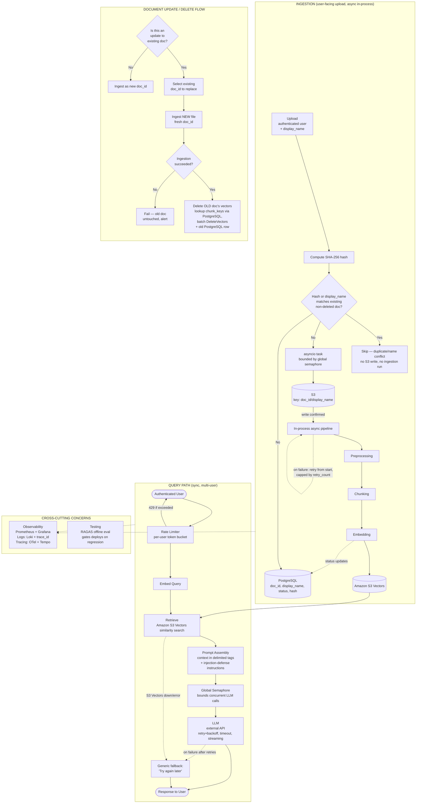

# RAG Bot — High Level Design (v1)

## 1. Overview

This document consolidates the high-level design for the RAG (Retrieval-Augmented Generation) bot, covering ingestion, query serving, observability, testing, and guardrails, as finalized through design discussion.

The system has two independent legs:
- **Ingestion (async)** — backend-triggered document upload, processing, and indexing
- **Query (sync, multi-user)** — authenticated end-user queries served through retrieval + LLM

---

## 2. Architecture Diagram

---

## 3. Ingestion Path

**Flow:** `Upload (user-facing) → Dedup check → S3 + PostgreSQL → asyncio task (concurrency-limited) → Preprocessing → Chunking → Embedding → Amazon S3 Vectors`

| Aspect | Decision |
|---|---|
| Trigger | **User-facing** — exposed to authenticated end users, not backend-only. Rate-limited per-user via the same token bucket used on the query endpoint |
| Document scoping | **None** — single shared/common document pool across all users; no per-user ownership, no `user_id` column on the documents table |
| Display name | User-entered `display_name`, required, **globally unique** (enforced via DB constraint filtered to non-deleted docs); used as the S3 key segment: `s3://{bucket}/documents/{doc_id}/{display_name}` |
| Upload mechanism | Backend writes directly to S3 via SDK (no presigned URL needed — no untrusted client bypassing the backend) |
| Non-blocking | S3 write + pipeline stages run as an in-process `asyncio` task, off the request/response cycle |
| Concurrency control | Global `asyncio.Semaphore` bounds how many ingestion pipelines run at once, tuned against the embedding provider's rate limits — **no Celery, no message broker (RabbitMQ/etc.) for v1** |
| Dedup | SHA-256 content hash computed **before** S3 upload; checked against PostgreSQL (`content_hash`, indexed, unique constraint) filtered to non-deleted docs. Match → skip entirely (no S3 write, no DB row, no ingestion run). Deleted docs' hashes don't block re-upload |
| Status tracking | DB row per document: `pending → scanning → parsing → chunking → embedding → indexed → failed`, plus `retry_count` |
| Retry strategy | On failure, retry runs the **entire pipeline from the start**, not from the failed stage — no per-stage task chain to resume from (v1 simplification). Capped at a max retry count |
| Crash recovery | No durable queue means an in-flight task is lost on process restart; mitigated by a periodic sweep for documents stuck in a non-terminal status |
| Persistence | PostgreSQL |
| Chunk metadata | Each chunk tagged with `doc_id` as filterable metadata in Amazon S3 Vectors; chunk keys additionally tracked in a PostgreSQL `chunks` table, since S3 Vectors' delete API requires explicit keys and has no delete-by-filter operation (see File Upload LLD for detail) |
| Embedding versioning | Vectors tagged with `embedding_model_version` as metadata in Amazon S3 Vectors for future migration support |

### 3.1 Update / Delete Flow

Explicit user intent drives this — no auto-detection of "is this an update":

1. Ask: **is this upload an update to an existing document?**
2. **If no** → ingest as new document, fresh `doc_id`
3. **If yes** → ask which existing `doc_id` is being replaced
4. **Ingest the new file first** (fresh `doc_id`, no version lineage) and verify success
5. **Only after success**, delete the old document's vectors from Amazon S3 Vectors (chunk keys looked up from PostgreSQL, then batch-deleted — S3 Vectors has no delete-by-filter) and remove/mark its DB row

This ordering avoids the failure mode where deleting old content first and having the new ingestion fail would leave the system with *no* version of the document at all. A brief window of duplicate content is preferred over a window of missing content.

**Note:** the hash-based dedup check (Section 3, above) also applies here — if the "updated" file's content hash matches the existing doc being replaced (byte-identical, nothing actually changed), short-circuit to "no changes detected" rather than running a pointless delete + re-ingest.

---

## 4. Query Path

**Flow:** `User → Rate Limiter → Embed Query → Retrieve (Amazon S3 Vectors) → Prompt Assembly → LLM → Response`

| Aspect | Decision |
|---|---|
| Auth | Reused from the hosting site's existing login/session — no separate API key layer |
| Rate limiting | Per-user token bucket, keyed by `user_id`. Capacity ~20 burst, refill ~5/sec (tune with real traffic). Redis-backed if multi-instance, in-memory if single-instance. Returns `429` + `Retry-After` on exceed |
| Concurrency control | Global semaphore bounding total outbound LLM calls across **all** users, sized to stay under the LLM provider's RPM/TPM tier |
| Retry strategy | Exponential backoff with jitter on `429`/`5xx` from the LLM API |
| Timeouts | Explicit per-call timeout on the LLM request; no reliance on SDK defaults |
| Streaming | Enabled — reduces perceived latency under load even when semaphore/queue adds wait time |
| Failure handling | Generic user-facing message ("Something went wrong. Please try again in a moment.") on any dependency failure (LLM exhausted retries, Amazon S3 Vectors unreachable/erroring, unhandled exception). Real error detail goes only to logs (`ERROR` level, tagged with `trace_id`), never exposed to the client |
| Guardrails (v1 scope) | Prompt-level structural defense only: retrieved context wrapped in explicit delimiters (e.g. `<context>` tags) with an instruction that content inside is data, never commands. Output moderation and PII redaction explicitly deferred to v2 |

---

## 5. Cross-Cutting: Observability

**Stack:** Prometheus + Grafana (metrics), Loki (logs), Tempo (traces) — the LGTM pattern, all correlated via `trace_id`.

### Metrics (query path only, v1 scope)

**Latency (p50/p90/p99 each):**
- End-to-end query latency
- Query embedding latency
- Retrieval latency (Amazon S3 Vectors)
- LLM latency

**Token & cost:**
- Input tokens / output tokens
- Cost per query and cumulative cost

**Throughput & concurrency:**
- QPS
- In-flight concurrent requests at the LLM call layer
- Queue depth / wait time (if backpressure queuing is implemented)

**Errors & reliability:**
- LLM API error rate, by type (`429`, `5xx`, timeout)
- Retry rate
- Retrieval error rate

**Retrieval quality:**
- Zero-result rate
- Top-k similarity score distribution

### Logging
- Structured JSON logs, every line carries `trace_id`
- Logged at stage boundaries (request received, query embedded, retrieval completed, LLM call started/completed, response sent, errors)
- Full prompt/response payloads gated behind `DEBUG` level or sampling — never logged raw at `INFO` by default
- No API keys or secrets in any log line, including exception messages

### Tracing
- OpenTelemetry spans per stage: `embed_query → retrieve_s3_vectors → build_prompt → llm_call`
- Trace context propagated across any service/process boundaries via W3C `traceparent`
- Sampling: partial rate at steady state, always-sample on error or latency-threshold breach

---

## 6. Cross-Cutting: Testing (RAGAS)

- **Purpose:** offline answer-quality evaluation, separate from production monitoring
- **Golden dataset:** curated `(question, ground_truth)` pairs covering real use cases and edge cases
- **Core metrics:** context precision, context recall, faithfulness, answer relevance — isolates whether retrieval or generation is at fault
- **Execution:** run in CI/scheduled job against the full pipeline, not on live traffic
- **Gate:** deploys blocked/flagged on quality regression vs. baseline, not on absolute score thresholds
- **Cost note:** RAGAS metrics are LLM-as-judge — track judge-model token cost separately from production LLM cost

---

## 7. Explicitly Deferred to v2

| Item | Reason for deferral |
|---|---|
| Full guardrails (output moderation, PII detection/redaction) | v1 ships with prompt-level injection defense only |
| Multi-turn conversation / session history | v1 is single-turn Q&A |
| Semantic/exact-match caching | Lower priority at current scale |
| Reranking | Retrieval quality acceptable without it for v1 |
| Prompt versioning / A-B testing infra | Not needed until prompt iteration frequency increases |
| User feedback loop (thumbs up/down) | Feeds future RAGAS dataset expansion, not blocking launch |
| Ingestion-side observability (metrics/tracing) | Query-path observability prioritized first |
| CI/CD and deployment topology | Process decision, not architecture-blocking |
| Document version lineage | Replace = delete + fresh insert, no history tracked in v1 |
| Celery + durable message broker for ingestion | v1 uses in-process `asyncio` + semaphore; revisit if ingestion volume or crash-durability needs outgrow this |

---

## 8. Summary

The v1 HLD is considered closed. All identified gaps across ingestion, query serving, concurrency, observability, testing, and guardrails have either been designed out above or explicitly deferred with reasoning. Implementation can proceed against this document as the reference design.