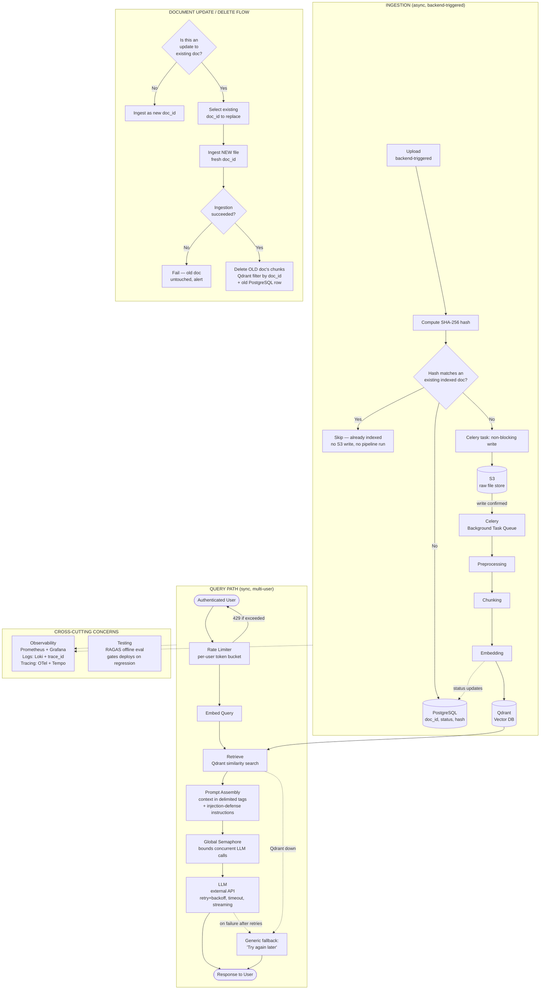

# RAG Bot — High Level Design (v1)

## 1. Overview

This document consolidates the high-level design for the RAG (Retrieval-Augmented Generation) bot, covering ingestion, query serving, observability, testing, and guardrails, as finalized through design discussion.

The system has two independent legs:
- **Ingestion (async)** — backend-triggered document upload, processing, and indexing
- **Query (sync, multi-user)** — authenticated end-user queries served through retrieval + LLM

---

## 2. Architecture Diagram

---

## 3. Ingestion Path

**Flow:** `Upload → S3 + DB → Celery (async) → Preprocessing → Chunking → Embedding → Qdrant`

| Aspect | Decision |
|---|---|
| Trigger | Backend-triggered, single origin (not exposed to arbitrary end users) |
| Upload mechanism | Backend writes directly to S3 via SDK (no presigned URL needed — no untrusted client) |
| Non-blocking | S3 write + pipeline stages run as Celery tasks, off the main request thread |
| Dedup | SHA-256 content hash computed **before** S3 upload; checked against PostgreSQL (`content_hash` indexed column) filtered to `status='indexed'` docs only. Match → skip entirely (no S3 write, no DB row, no Celery run). No match → proceed with upload + ingestion. Deleted docs' hashes don't block re-upload |
| Status tracking | DB row per document: `pending_upload → uploaded → parsing → chunking → embedding → indexed → failed` |
| Persistence | PostgreSQL |
| Chunk metadata | Each chunk tagged with `doc_id` (indexed payload field in Qdrant) for later filtering/deletion |
| Embedding versioning | Vectors tagged with `embedding_model_version` in Qdrant payload for future migration support |

### 3.1 Update / Delete Flow

Explicit user intent drives this — no auto-detection of "is this an update":

1. Ask: **is this upload an update to an existing document?**
2. **If no** → ingest as new document, fresh `doc_id`
3. **If yes** → ask which existing `doc_id` is being replaced
4. **Ingest the new file first** (fresh `doc_id`, no version lineage) and verify success
5. **Only after success**, delete the old document's chunks from Qdrant (filtered by old `doc_id`) and remove/mark its DB row

This ordering avoids the failure mode where deleting old content first and having the new ingestion fail would leave the system with *no* version of the document at all. A brief window of duplicate content is preferred over a window of missing content.

**Note:** the hash-based dedup check (Section 3, above) also applies here — if the "updated" file's content hash matches the existing doc being replaced (byte-identical, nothing actually changed), short-circuit to "no changes detected" rather than running a pointless delete + re-ingest.

---

## 4. Query Path

**Flow:** `User → Rate Limiter → Embed Query → Retrieve (Qdrant) → Prompt Assembly → LLM → Response`

| Aspect | Decision |
|---|---|
| Auth | Reused from the hosting site's existing login/session — no separate API key layer |
| Rate limiting | Per-user token bucket, keyed by `user_id`. Capacity ~20 burst, refill ~5/sec (tune with real traffic). Redis-backed if multi-instance, in-memory if single-instance. Returns `429` + `Retry-After` on exceed |
| Concurrency control | Global semaphore bounding total outbound LLM calls across **all** users, sized to stay under the LLM provider's RPM/TPM tier |
| Retry strategy | Exponential backoff with jitter on `429`/`5xx` from the LLM API |
| Timeouts | Explicit per-call timeout on the LLM request; no reliance on SDK defaults |
| Streaming | Enabled — reduces perceived latency under load even when semaphore/queue adds wait time |
| Failure handling | Generic user-facing message ("Something went wrong. Please try again in a moment.") on any dependency failure (LLM exhausted retries, Qdrant unreachable, unhandled exception). Real error detail goes only to logs (`ERROR` level, tagged with `trace_id`), never exposed to the client |
| Guardrails (v1 scope) | Prompt-level structural defense only: retrieved context wrapped in explicit delimiters (e.g. `<context>` tags) with an instruction that content inside is data, never commands. Output moderation and PII redaction explicitly deferred to v2 |

---

## 5. Cross-Cutting: Observability

**Stack:** Prometheus + Grafana (metrics), Loki (logs), Tempo (traces) — the LGTM pattern, all correlated via `trace_id`.

### Metrics (query path only, v1 scope)

**Latency (p50/p90/p99 each):**
- End-to-end query latency
- Query embedding latency
- Retrieval latency (Qdrant)
- LLM latency

**Token & cost:**
- Input tokens / output tokens
- Cost per query and cumulative cost

**Throughput & concurrency:**
- QPS
- In-flight concurrent requests at the LLM call layer
- Queue depth / wait time (if backpressure queuing is implemented)

**Errors & reliability:**
- LLM API error rate, by type (`429`, `5xx`, timeout)
- Retry rate
- Retrieval error rate

**Retrieval quality:**
- Zero-result rate
- Top-k similarity score distribution

### Logging
- Structured JSON logs, every line carries `trace_id`
- Logged at stage boundaries (request received, query embedded, retrieval completed, LLM call started/completed, response sent, errors)
- Full prompt/response payloads gated behind `DEBUG` level or sampling — never logged raw at `INFO` by default
- No API keys or secrets in any log line, including exception messages

### Tracing
- OpenTelemetry spans per stage: `embed_query → retrieve_qdrant → build_prompt → llm_call`
- Trace context propagated across any service/process boundaries via W3C `traceparent`
- Sampling: partial rate at steady state, always-sample on error or latency-threshold breach

---

## 6. Cross-Cutting: Testing (RAGAS)

- **Purpose:** offline answer-quality evaluation, separate from production monitoring
- **Golden dataset:** curated `(question, ground_truth)` pairs covering real use cases and edge cases
- **Core metrics:** context precision, context recall, faithfulness, answer relevance — isolates whether retrieval or generation is at fault
- **Execution:** run in CI/scheduled job against the full pipeline, not on live traffic
- **Gate:** deploys blocked/flagged on quality regression vs. baseline, not on absolute score thresholds
- **Cost note:** RAGAS metrics are LLM-as-judge — track judge-model token cost separately from production LLM cost
