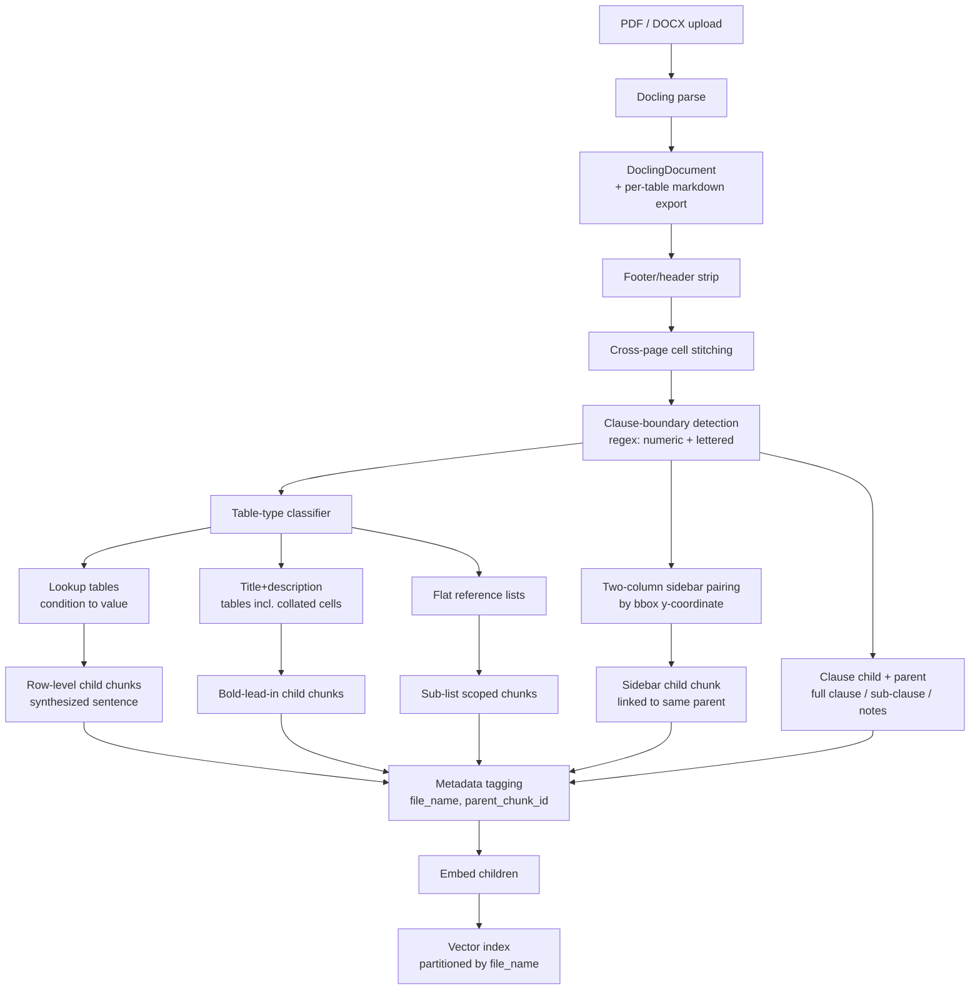

# Insurance Policy RAG — Ingestion LLD

Sep 25, 2026 · @Rishu

Docling-based ingestion pipeline for multi-policy insurance PDFs/DOCX, using clause-boundary-driven parent-child chunking rather than fixed-size or Docling's default heading-based chunking.

## Pipeline overview

Children are embedded and searched; parents (full clause, or the relevant sub-table) are resolved at retrieval time and passed to the LLM as context.

## Step 1 — Parsing (Docling)

Docling parses PDF and DOCX into one `DoclingDocument` structure, giving a consistent input regardless of source format.

- Tables are exported per-table via `export_to_markdown()` — this is one markdown blob per table, not per row; row-splitting is custom logic built on top (Step 4).
- Docling's `HybridChunker` and its heading-based section detection are **not used** for chunk boundaries — insurance clause headings (e.g. "4.14.2 Permanent Total Disability") are often bold inline text, not styled document headings, so Docling may not detect them consistently. Clause boundaries come from a custom regex pass instead (Step 2).
- Docling's table structure model (TableFormer) is reliable on regular bordered grids but weaker on multi-tier/nested headers — this is an industry-wide limitation, not Docling-specific. QA each new document's tables by hand before trusting automated row extraction on them.

## Step 2 — Structural boundary detection

**Clause numbering.** Boundaries are found via regex on paragraph starts, not Docling's own layout headings:

- Numeric pattern: `^\d+\.\d+(\.\d+)?` (e.g. 4.1, 4.14.2)
- Lettered pattern: `^[A-Z]\.\s` recognized as a sub-clause boundary once a clause has already established a lettered-list context (e.g. clause 4.53 International Cover uses A, B, C … L instead of numbers)
- Clause numbering schemes are **not assumed consistent across policies** — e.g. "4.x" is Benefits in ReAssure 3.0/2.0 but is waiting-period exclusion codes in Health Companion. Each policy's own CIS "Sl. No / Title / Description / Clause" table is extracted first and used as that policy's section-type fingerprint, rather than hardcoding one numbering convention globally.

**Cross-page cell stitching.** Table cells (notably large merged cells like "Policy Coverage") can split across a page break with no repeated header row on the next page. Detection heuristic, run before clause/table-type logic:

1. Last block on page N ends mid-sentence or with an incomplete bold lead-in (no trailing description, no terminal punctuation).
2. First block on page N+1 starts with plain-text continuation (lowercase start, no new bold lead-in, no repeated column headers).
3. If both hold, strip intervening footer/header boilerplate and concatenate the two fragments into one continuous string *before* any further splitting.

Scoped narrowly to cells still "open" at the bottom of a page — not a blanket "always merge across pages" rule, to avoid gluing together genuinely separate tables that happen to straddle a break. Resulting chunk keeps `source_pages: [N, N+1]` in metadata for citation/debugging.

## Step 3 — Parent-child chunking for clause text

Small-to-big pattern: the child is embedded and searched; the parent is resolved and passed to the LLM as generation context. The parent is never itself indexed as a separate searchable vector.

| Level | Unit | Role |
| --- | --- | --- |
| Child | Sub-clause (e.g. 4.1.2 Air Ambulance) | Embedded, searched |
| Notes | Appended to the sub-clause they immediately follow | Never an independent searchable unit |
| Parent | Full clause (e.g. 4.1, with 4.1.1 + 4.1.2 + notes) | Returned as context, not searched |

- A clause with no sub-clauses (e.g. flat clause 4.44 Critical Illness) is simultaneously its own child and parent — no artificial split.
- A Note by itself is meaningless without its parent sub-clause, so it is stored as part of the sub-clause's text, not chunked independently.
- `related_exclusions` and `distinct_from` structured fields are **deferred** (out of scope for now) — disambiguation between lookalike clauses (e.g. Accidental Death vs. Permanent Total Disability) is instead expected to fall out naturally from the parent being returned alongside the child at retrieval time.

## Step 4 — Table handling by type

A table-type classifier runs before chunking decisions, routing each extracted table to one of three treatments. All three converge on the same underlying rule: **split on bold-lead-in / title boundaries, whatever form they take**, then treat each item as its own child.

**A. Lookup tables** (condition → value: PTD/PPD percentages, room-category co-payment, discount-by-points)

- One child chunk per row.
- Row text is rewritten into a synthesized natural-language sentence for embedding, not the raw cell values — e.g. "Sight of both eyes → 125%" becomes "Loss of sight in both eyes, complete and irrecoverable, pays 125% of the Accidental Death Sum Insured under Permanent Total Disability."
- Multi-tier/nested headers are flattened into a single header string per column before row synthesis (e.g. "Total points" + "Individual sum insured policy" → "Discount – Individual sum insured policy").
- Parent context passed to the LLM at generation time = the whole small lookup table (e.g. the 2-row PTD table) in markdown, not just the isolated matched row — this gives the LLM sibling rows for context without needing a separate disambiguation field.

**B. Title + description tables** (CIS "Sl.No / Title / Description / Clause" columns, and collated-cell variants like the "Policy Coverage" row where titles appear as bold inline lead-ins inside one merged cell rather than a separate column)

- Same treatment regardless of visual shape: detect the title boundary (bold run + colon, or a separate Title column), collate title into its description, and chunk each title+description pair as its own child.
- For collated-cell tables specifically: children are each bold-lead-in + its following text (e.g. "Ambulance", "Hospitalization expenses", "Modern Treatments", "Booster+" each become separate children) — not an arbitrary token-count split of the whole cell, and not one chunk per whole cell.
- Placeholder detection (`contains_placeholder: true`) runs per child after splitting — several Niva Bupa CIS templates (e.g. ReAssure 2.0) contain literal `<>` values that must never be presented as an answer.
- CIS enumeration content is **not** given special separate handling (Point 7) — it goes through this same title+description path as ordinary chunking. Consequence: enumeration-style queries ("what are the inclusions") need a retrieval-side fetch-all by `file_name + section`, not top-k semantic search, since top-k over 40–55 similarly-phrased benefit children will arbitrarily omit some.

**C. Flat reference lists** (Annexure I non-payables, ombudsman addresses, health-checkup-by-variant matrix)

- Chunked as non-table rows per the general rule, scoped by natural sub-list boundary (List I / II / III / IV), never as one chunk spanning the full list.

## Step 5 — Two-column sidebar pairing

Applies to pages like Section 6 of the ReAssure Policy Wording, where a legal clause runs in a wide left column with a "Simplified for you" box in a narrow right column, on the same page — not a full-width table, and not a page continuation.

- Docling's layout model correctly segments left-column vs. right-column as separate reading blocks, but linearized reading order alone does not tell us which right-column box pairs with which left-column clause when a page has more than one of each (as it does here: 6.1.1 and 6.1.2 each get their own box).
- Pairing is resolved by comparing bounding-box y-coordinates: a sidebar box is paired to whichever left-column clause occupies the same vertical band on the page.
- The paired sidebar text becomes its **own additional child chunk** under the same parent clause — not folded into the legal-text child. This gives two retrieval entry points into the same clause: the formal legal wording and the colloquial paraphrase (e.g. "You can cancel your policy whenever you wish" vs. "The policy holder may cancel his/her policy at any time during the term, by giving 7 days' notice in writing") — directly helping vocabulary-mismatch queries ("expiring policy bonus" style) without a hand-built alias table.

## Step 6 — Chunk metadata schema

Every child chunk, regardless of source type, carries:

| Field | Purpose |
| --- | --- |
| `file_name` | The source file's unique name. Used as a hard pre-search filter / index partition, not a post-filter, so cross-policy content never enters the candidate set. Retrieval matches on `file_name` prefix (e.g. all files for "ReAssure 3.0"), so the naming convention across a policy's own files (Policy Wording, CIS, etc.) must be enforced consistently at upload — a mismatched prefix (e.g. a CIS file not starting with the same product name) will silently fall outside the filter. |
| `product_name` | Display use only. |
| `parent_chunk_id` | Points a child to its resolvable parent (full clause, or the relevant scoped sub-table). |
| `contains_placeholder` | `true` when the source text still has a literal `<>` — never presented as an answer. |
| `source_pages` | Page(s) the chunk came from, including stitched cross-page chunks. |

**Policy isolation** is enforced at the index level: either per-`file_name` namespaces/collections, or metadata-filtered ANN search applied *before* the vector search runs — never top-k-then-discard, since near-identical boilerplate across an insurer's own product family (ReAssure 2.0/3.0, Health Companion all share large sections of near-identical wording) can otherwise crowd out the correct policy's sparse matches.

## Resolved decisions and open items

**Resolved (agreed in discussion):**

1. `file_name` filtering happens before vector search, as a hard pre-filter / index partition.
2. Table children are synthesized sentences with immediate parent context, chunked parent-child.
3. Query-time flow: policy filter → semantic search over children → parent resolved for generation context.
4. Two-column sidebar text is a bonus child chunk under the correct clause's parent, paired by bbox y-coordinate.
5. Title+description pattern applies uniformly whether rendered as separate columns or collated bold-lead-in cells; split boundary = the bold lead-in itself.
6. `related_exclusions` and `distinct_from` deferred — disambiguation instead relies on returning the full parent clause/table as generation context.
7. CIS content is not given special separate ingestion handling; it is chunked through the same title+description path as everything else — pushing enumeration-completeness to a retrieval-side fetch-all rule instead.

**Still open (flagged, not yet decided):**

- Whether `parent_chunk_id` should point to a stored parent-text field on the child, or to a separate parent lookup store (LlamaIndex/LangChain-style parent-document retriever) — an implementation choice, not a design one, but needs picking before build.
- Whether the fetch-all rule for enumeration queries (Step 4B) is triggered by query-pattern classification (regex/intent model on the incoming question) or left as a manual query-type toggle in the UI.
- Confirming whether Docling's own document assembly already stitches some cross-page cells correctly before the custom stitcher (Step 2) runs, to avoid double-handling — needs validation against actual Docling output on this document set.