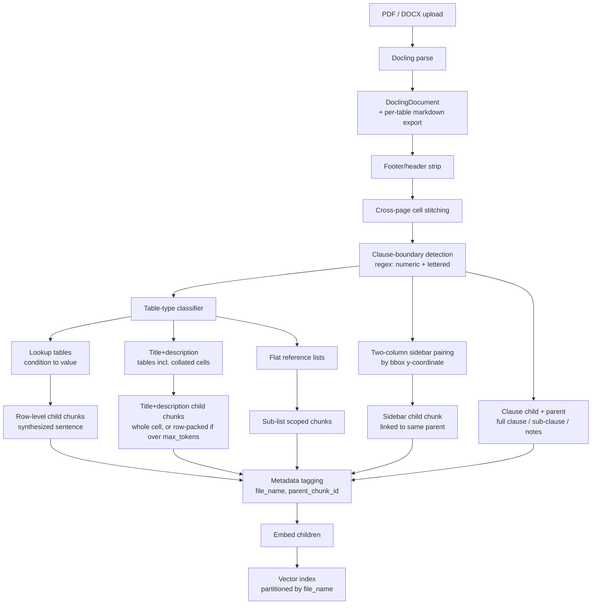

# Insurance Policy RAG — Ingestion LLD

Sep 25, 2026 · @Rishu

Docling-based ingestion pipeline for multi-policy insurance PDFs/DOCX, using clause-boundary-driven parent-child chunking rather than fixed-size or Docling's default heading-based chunking.

## Pipeline overview

Children are embedded and searched; parents (full clause, or the relevant sub-table) are resolved at retrieval time and passed to the LLM as context.

## Step 1 — Parsing (Docling)

Docling parses PDF and DOCX into one `DoclingDocument` structure, giving a consistent input regardless of source format.

- Tables are exported per-table via `export_to_markdown()` — this is one markdown blob per table, not per row; row-splitting is custom logic built on top (Step 4).
- Docling's `HybridChunker` and its heading-based section detection are **not used** for chunk boundaries — insurance clause headings (e.g. "4.14.2 Permanent Total Disability") are often bold inline text, not styled document headings, so Docling may not detect them consistently. Clause boundaries come from a custom regex pass instead (Step 2).
- **Layout tables.** Docling's table model sometimes reads a two-column policy page (legal clauses beside a "Simplified for you" column) as a table, and the grid comes back with words from neighbouring clauses shuffled between cells (e.g. Health Companion 5.2.5–5.2.10, ReAssure 6.1.13–6.1.17 and 6.2.8). A table whose first column contains only clause numbers (and blanks for continuation rows) is classed as a layout table; its text is re-read from the PDF text layer (PyMuPDF) inside the table's bounding box, in reading order, and fed to Step 2 as ordinary blocks. Real tables become `table` markers in the block stream so each keeps its place in the clause flow and is recorded in the `tables` field of the clause chunks it sits under.
- Docling's table structure model (TableFormer) is reliable on regular bordered grids but weaker on multi-tier/nested headers — this is an industry-wide limitation, not Docling-specific. QA each new document's tables by hand before trusting automated row extraction on them.

## Step 2 — Structural boundary detection

**Clause numbering.** Boundaries are found via regex on paragraph starts, not Docling's own layout headings:

- Numeric pattern: `^\d+\.\d+(\.\d+)?` (e.g. 4.1, 4.14.2)
- Lettered pattern: `^[A-Z]\.\s` recognized as a sub-clause boundary once a clause has already established a lettered-list context (e.g. clause 4.53 International Cover uses A, B, C … L instead of numbers)
- Clause numbering schemes are **not assumed consistent across policies** — e.g. "4.x" is Benefits in ReAssure 3.0/2.0 but is waiting-period exclusion codes in Health Companion. Each policy's own CIS "Sl. No / Title / Description / Clause" table is extracted first and used as that policy's section-type fingerprint, rather than hardcoding one numbering convention globally.

**Annexures.** A heading of the form "Annexure <roman/number> - …" (or "Appendix …") is a section boundary at the level of "4. Benefits", whatever label Docling gave it (`section_header`, `caption` or `text`). It has no clause number, so its chunks carry `clauses: []` and `section: <annexure heading>`, and the tables and prose under it take the annexure name as their title. This keeps annexure text out of the preceding numbered clause (otherwise "7. Coverage Standards & Protocols" absorbed Annexures I–V and reported pages 44–62). A section that contains only tables still gets a parent, so its tables can take its title. Note: ReAssure 3.0 has no "Annexure IV" heading in the PDF (only a reference on page 25), so its critical-illness tables (pages 54–61) fall under Annexure III.

**Documents with no numbered clauses.** If a document has no "4.1" / "4." style headings at all, Docling's own headings become the boundaries instead (otherwise the whole document would be one parent with untitled, size-packed children). A heading of level *L* becomes a node at depth *L*+1, so a level-1 heading is a parent (full section) and a level-2 heading is its child; text before the first heading is front matter; a bare label such as "Note:" stays in the body of the section above. Oversized sections use the same `max_tokens` packing, each child prefixed with the heading, and `section` is the level-1 heading. Docling reports every heading as level 1 on the current sample files, so nesting stays flat until a PDF yields real levels. Numbered documents (both policy wordings) are unaffected.

**Cross-page cell stitching.** Table cells (notably large merged cells like "Policy Coverage") can split across a page break with no repeated header row on the next page. Detection heuristic, run before clause/table-type logic:

1. Last block on page N ends mid-sentence (no terminal punctuation).
2. First block on page N+1 starts with plain-text continuation (lowercase start, no repeated column headers).
3. If both hold, strip intervening footer/header boilerplate and concatenate the two fragments into one continuous string *before* any further splitting.

Scoped narrowly to cells still "open" at the bottom of a page — not a blanket "always merge across pages" rule, to avoid gluing together genuinely separate tables that happen to straddle a break. Resulting chunk keeps `source_pages: [N, N+1]` in metadata for citation/debugging.

## Step 3 — Parent-child chunking for clause text

Small-to-big pattern: the child is embedded and searched; the parent is resolved and passed to the LLM as generation context. The parent is never itself indexed as a separate searchable vector.

| Level | Unit | Role |
| --- | --- | --- |
| Child | Sub-clause (e.g. 4.1.2 Air Ambulance) | Embedded, searched |
| Notes | Appended to the sub-clause they immediately follow | Never an independent searchable unit |
| Parent | Full clause (e.g. 4.1, with 4.1.1 + 4.1.2 + notes) | Returned as context, not searched |

- A clause with no sub-clauses (e.g. flat clause 4.44 Critical Illness) is simultaneously its own child and parent — no artificial split.
- A Note by itself is meaningless without its parent sub-clause, so it is stored as part of the sub-clause's text, not chunked independently.
- **Oversized units.** The same splitter as Step 4B applies to any unit (clause, sub-clause, list item, collated cell) longer than `max_tokens` (default **500**, configurable): the whole unit stays as the parent, and children are packed at natural cut points (bullet/row markers, then paragraph, then sentence), each prefixed with its clause number/title. Units at or under the limit are never split.
- `related_exclusions` and `distinct_from` structured fields are **deferred** (out of scope for now) — disambiguation between lookalike clauses (e.g. Accidental Death vs. Permanent Total Disability) is instead expected to fall out naturally from the parent being returned alongside the child at retrieval time.

## Step 4 — Table handling by type

A table-type classifier runs before chunking decisions, routing each extracted table to one of three treatments. Formatting (bold/italic) is **never used** as a boundary signal: Docling does not expose inline bold for PDFs, and where it exists in the source it is inconsistent (e.g. in the ReAssure 3.0 CIS "Policy Coverage" cell only some list numerals are bold, while the benefit names mostly are not). Boundaries come from table structure (rows/columns) and list numbering only.

**A. Lookup tables** (condition → value: PTD/PPD percentages, room-category co-payment, discount-by-points)

- One child chunk per row.
- Row text is rewritten into a synthesized natural-language sentence for embedding, not the raw cell values — e.g. "Sight of both eyes → 125%" becomes "Loss of sight in both eyes, complete and irrecoverable, pays 125% of the Accidental Death Sum Insured under Permanent Total Disability."
- Multi-tier/nested headers are flattened into a single header string per column before row synthesis (e.g. "Total points" + "Individual sum insured policy" → "Discount – Individual sum insured policy").
- **Implementation (template, no LLM).** A table is classed as a lookup table when its trailing column(s) are mostly (≥ 80%) percentages and it has at least 2 data rows. Leading rows with no percentage are header rows; multi-tier headers are flattened per column joined with " – ", cut at a "NOTE" footnote and capped at 80 chars. Mostly-blank condition columns (vertical merges) are filled downwards. The child sentence is `<clause title>. <condition header>: <condition>. <value header>: <value>.` — e.g. "4.14.2. Permanent Total Disability. Condition for Permanent Total Disability: Complete & Irrecoverable loss of: 1 Limb; Sight of 1 Eye. % of Accidental Death Sum Insured: 50%." A fixed template cannot reword the row into prose like the example above; that would need an LLM. Children keep the original row in `source_row`. If a column name contains a percentage, Docling has folded a data row into the header (seen on ReAssure 3.0 discount tables, pages 13–14), and the table's chunks are flagged `needs_review`.
- Parent context passed to the LLM at generation time = the whole small lookup table (e.g. the 2-row PTD table) in markdown, not just the isolated matched row — this gives the LLM sibling rows for context without needing a separate disambiguation field.

**B. Title + description tables** (CIS "Sl.No / Title / Description / Clause" columns, including collated variants like the "Policy Coverage" row, where one title covers many numbered benefits)

- **Separate Title column, one item per row:** one child per row, title joined to its description.
- **Collated title (one title spanning many rows/bullets):** no title detection and no title/CIS dictionary. Docling's TableFormer splits such a cell into one row per numbered item (e.g. "1. Expenses in reaching the hospital…", "2. …") and leaves the Title cell empty on all but the first row (vertical merge). Steps:
  1. **Forward-fill** the Title down its vertical span.
  2. **Regroup** the spanned rows, in order and with their `1.`/`2.` markers, into one logical cell.
  3. If the cell is ≤ `max_tokens` (configurable, default 500), it is **one chunk**, both child and parent (same rule as a flat clause in Step 3).
  4. If it exceeds `max_tokens`, the **whole cell is the parent** (stored, not searched) and children are made by **packing consecutive rows** up to `max_tokens`. Rows/bullets are cut points, not chunk units — this avoids one tiny chunk per bullet. A single row larger than `max_tokens` is split at sentence boundaries. Each child is prefixed with the title (e.g. "Policy Coverage: …") so a fragment stays identifiable.
  5. If a cell has no row structure (a true single cell), fall back to splitting on list-marker patterns at line/paragraph starts, then sentences.
- **CIS tables in practice.** A CIS is one logical "Sl. No / Title / Description / Clause" table spread over ~10 pages, and Docling's grid for it changes shape page to page (4, 3, 2 or 1 columns; titles glued to the start of descriptions; a whole continuation page as one cell; clause cells concatenated like "5.1.3 5.1.2 5.1.1 5.2.1"). Rows are therefore rebuilt by rule, not by column position: (1) the CIS tables are those from the header table up to the first table wider than 6 columns (the premium illustrations); (2) a grid row with a Title cell starts a new logical row — its Sl. No. is inferred as previous+1 when the cell is lost, and a lowercase title fragment with no Sl. No. is treated as the tail of the previous description; rows with no title continue the current row; (3) a title glued to its description is cut at the first list marker; (4) a cell holding only clause numbers is that grid row's clause cell. Each grid row is one *piece* of the logical row, and pieces are the cut points for the `max_tokens` packing above. A child's `clauses` is the union over the pieces it contains. Limitation: when Docling merges several list items into one cell (e.g. Policy Coverage items 4–23 on ReAssure CIS p2), that piece cannot be split further by clause, so its children carry all of that cell's clauses.
- **Clause column:** where the table has a Clause column (as CIS tables do), each row's clause reference is carried into the child's `clauses` metadata (Step 6). This links a child back to the exact policy-wording clauses.
- Placeholder detection (`contains_placeholder: true`) runs per child after splitting — several Niva Bupa CIS templates (e.g. ReAssure 2.0) contain literal `<>` values that must never be presented as an answer.
- CIS enumeration content is **not** given special separate handling (Point 7) — it goes through this same title+description path as ordinary chunking. Consequence: enumeration-style queries ("what are the inclusions") need a retrieval-side fetch-all by `file_name + section`, not top-k semantic search, since top-k over 40–55 similarly-phrased benefit children will arbitrarily omit some.

**Generic fallback (interim, all tables not handled by A–C or the CIS/layout rules).** Every remaining table is emitted as markdown so nothing is dropped: ≤ `max_tokens` → one chunk (child and parent); larger → parent = whole table, children = consecutive rows packed up to `max_tokens` with the header rows repeated on each (title only if the header alone exceeds half the budget). Each chunk is titled "Table under <clause title> (page N)" and takes `clauses`/`section` from the clause it sits under. Tables split across pages are stitched when: they are consecutive, on consecutive pages, have the same column count, the next one starts in the top 20% of its page and the previous one ends in the bottom 35%; a first row identical to the previous header is dropped (repeated header), while a first row that begins with the same word but differs ("Condition for Permanent Total…" vs "…Partial…") starts a new table. The specific treatments A–C replace this per table type as they are built.

**C. Flat reference lists** (Annexure I non-payables, ombudsman addresses, health-checkup-by-variant matrix)

- Chunked as non-table rows per the general rule, scoped by natural sub-list boundary (List I / II / III / IV), never as one chunk spanning the full list.
- **Implementation.**
  - *Numbered lists* ("Sl. No. | Item" repeated side by side, or a single pair such as "S. No. | Vaccination Name") are unpivoted pair by pair, so the list reads in order (`1. BABY FOOD` … `68. VASOFIX SAFETY`). One list is one unit (≤ `max_tokens` → one chunk; larger → parent-child packed at item boundaries), titled with its heading (e.g. "List II - Items that are to be subsumed into Room Charges").
  - *Same-header lists* ("List of tests covered:" repeated across columns) are one list of all cells.
  - *Entry tables* (2 columns, e.g. "Office Details | Jurisdiction" for ombudsmen) give one chunk per row; a row holding only a short label (a city name the table model split from its entry) is joined to the row below.
  - *Sub-list boundaries.* Docling links a table's caption to the table although the caption follows it in reading order (e.g. "List I - Expenses not covered"), so a table's own caption is its title and not a heading of the next table. Tables stitched across pages (Step 4 fallback) are kept apart when the next one repeats the header and a heading sits between them (List II → III → IV); a headerless continuation still joins.

## Step 5 — Two-column sidebar pairing

Applies to pages like Section 6 of the ReAssure Policy Wording, where a legal clause runs in a wide left column with a "Simplified for you" box in a narrow right column, on the same page — not a full-width table, and not a page continuation.

- Docling's layout model correctly segments left-column vs. right-column as separate reading blocks, but linearized reading order alone does not tell us which right-column box pairs with which left-column clause when a page has more than one of each (as it does here: 6.1.1 and 6.1.2 each get their own box).
- Pairing is resolved by comparing bounding-box y-coordinates: a sidebar box is paired to whichever left-column clause occupies the same vertical band on the page.
- **Two problems found on ReAssure 3.0 (pages 34–40, 10 sidebar boxes):**
  1. *Reading order.* Docling emits a sidebar box after the left-column text, so without pairing each box lands in whichever clause chunk ends the page — e.g. the "After 5 years, no health insurance claim shall be contestable…" box (6.1.10 Moratorium Period, p38 y≈154, beside 6.1.10) ends up inside the 6.1.12 chunk, and the p34 boxes for 6.1.1 and 6.1.2 land in 6.1.3. Pairing is needed to fix existing misplacement, not just to add a bonus chunk.
  2. *A repeated box.* On p38 the "In case you have multiple policies…" box (y≈397, beside 6.1.11 Multiple Policies) pairs correctly by y. The identical box is printed again on p39 (y≈468) beside 6.1.14 Disclosure of Information / 6.1.15, so a pure y-overlap rule pairs it with the wrong clause and creates a duplicate. Pairing must ignore a sidebar whose text is identical to one already paired on the previous page. A box at the top of a page can also belong to the clause that started on the previous page (p36 y≈118).
  3. *Boxes drift from their clause.* The sidebar is a flowing column, not aligned row by row. On ReAssure p35 the "Simplified for you" box starts level with 6.1.5 Nomination (header y≈442, box y≈443) but its paragraphs are about fraud and renewal ("Fraud is an action by you…", "Pay your renewal premium… grace period"), while 6.1.6 Fraud starts lower (y≈664). On p36 the paragraphs "Note: Non standard decisions…", "Rejection – We hate to do this", "IMPORTANT: We understand…" sit beside 6.1.6–6.1.8 but explain 6.1.6. Pairing by y is right on p34, p37, p38 and p40 but not on p35–36, so a y-band pairing needs a check against the clause text, and its result should carry a confidence flag.
- **Guards against mistaking other content for a sidebar.** A block is a sidebar candidate only if it starts right of 68% of the page width, is at most 30% of the page wide and ends at or beyond 75% of the width. The candidates on a page are accepted as a sidebar only if (a) their mean length is at least 50 characters — table cells such as "INR 2,000" are far shorter, so a table column stays in the text — and (b) they hold at most 40% of the page's text; above that it is a two-column layout and the blocks stay in the main flow, where Docling reads the left column then the right. A rejected page prints a warning. Measured on the sample files, real sidebars are 0.10–0.25 wide, end at 0.80–0.95, average 58+ characters per block and hold 3–32% of the page text. Separately, a table is treated as a layout page (text re-read from the PDF, see Step 1) only if it also has at least 3 cells longer than 80 characters (the real ones have 5–18), so a headerless table of short values, or a continuation page of one, stays a table.
- **Implementation (y-band).** Sidebar blocks that pass those guards are removed from the text flow. Each paragraph is paired with the last clause header at or above its y on that page, or the clause carried over from the previous page when it sits above every header. A paragraph whose text repeats one already paired is skipped. Consecutive paragraphs paired to the same clause on the same page form one `sidebar` child under that clause's parent. A short header in the sidebar column ("Simplified for you", "What it means?") is the box title, not content. Every sidebar block and its status (`paired` / `duplicate` / `title`) is written to `sidebars.jsonl`.
- The paired sidebar text becomes its **own additional child chunk** under the same parent clause — not folded into the legal-text child. This gives two retrieval entry points into the same clause: the formal legal wording and the colloquial paraphrase (e.g. "You can cancel your policy whenever you wish" vs. "The policy holder may cancel his/her policy at any time during the term, by giving 7 days' notice in writing") — directly helping vocabulary-mismatch queries ("expiring policy bonus" style) without a hand-built alias table.

## Step 6 — Chunk metadata schema

Every child chunk, regardless of source type, carries:

| Field | Purpose |
| --- | --- |
| `file_name` | The source file's unique name. Used as a hard pre-search filter / index partition, not a post-filter, so cross-policy content never enters the candidate set. Retrieval matches on `file_name` prefix (e.g. all files for "ReAssure 3.0"), so the naming convention across a policy's own files (Policy Wording, CIS, etc.) must be enforced consistently at upload — a mismatched prefix (e.g. a CIS file not starting with the same product name) will silently fall outside the filter. |
| `product_name` | Display use only. |
| `parent_chunk_id` | Points a child to its resolvable parent (full clause, or the relevant scoped sub-table). |
| `contains_placeholder` | `true` when the source text still has a literal `<>` — never presented as an answer. |
| `source_pages` | Page(s) the chunk came from, including stitched cross-page chunks. |
| `clauses` | Policy-wording clause references taken from a table's Clause column (e.g. `["4.1", "4.2.1", "4.2.2"]` for a packed child). Empty when the source has no clause column. |

**Policy isolation** is enforced at the index level: either per-`file_name` namespaces/collections, or metadata-filtered ANN search applied *before* the vector search runs — never top-k-then-discard, since near-identical boilerplate across an insurer's own product family (ReAssure 2.0/3.0, Health Companion all share large sections of near-identical wording) can otherwise crowd out the correct policy's sparse matches.

## Resolved decisions and open items

**Resolved (agreed in discussion):**

1. `file_name` filtering happens before vector search, as a hard pre-filter / index partition.
2. Table children are synthesized sentences with immediate parent context, chunked parent-child.
3. Query-time flow: policy filter → semantic search over children → parent resolved for generation context.
4. Two-column sidebar text is a bonus child chunk under the correct clause's parent, paired by bbox y-coordinate.
5. Title+description tables: separate Title column → one child per row. Collated title spanning many rows → kept whole if ≤ `max_tokens`, else parent-child with children packed from consecutive rows (rows are cut points). No bold detection and no CIS title dictionary.
6. `related_exclusions` and `distinct_from` deferred — disambiguation instead relies on returning the full parent clause/table as generation context.
7. CIS content is not given special separate ingestion handling; it is chunked through the same title+description path as everything else — pushing enumeration-completeness to a retrieval-side fetch-all rule instead.

**Still open (flagged, not yet decided):**

- Whether `parent_chunk_id` should point to a stored parent-text field on the child, or to a separate parent lookup store (LlamaIndex/LangChain-style parent-document retriever) — an implementation choice, not a design one, but needs picking before build.
- Whether the fetch-all rule for enumeration queries (Step 4B) is triggered by query-pattern classification (regex/intent model on the incoming question) or left as a manual query-type toggle in the UI.
- Confirming whether Docling's own document assembly already stitches some cross-page cells correctly before the custom stitcher (Step 2) runs, to avoid double-handling — needs validation against actual Docling output on this document set.
